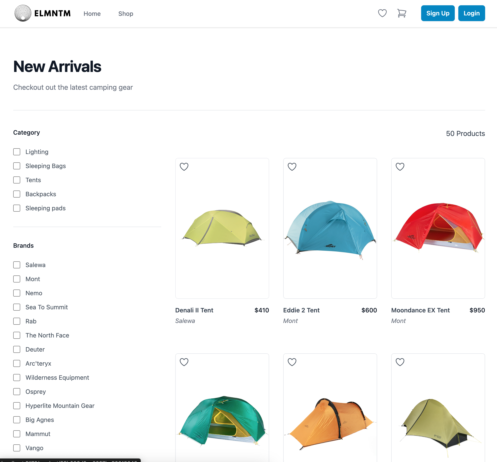
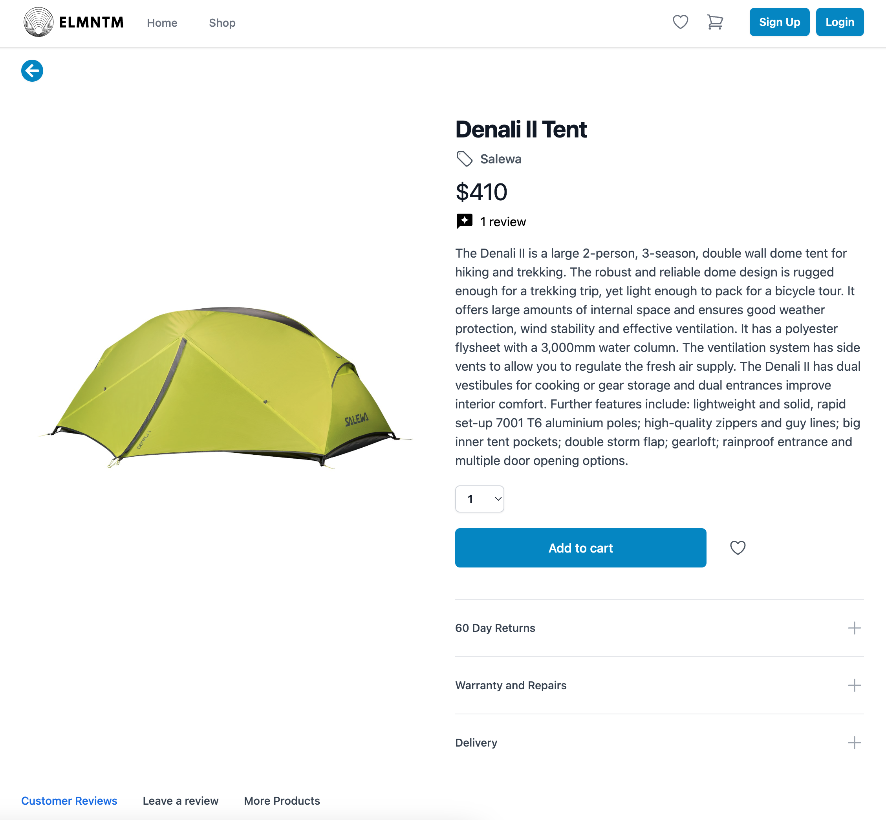

# ELMNTM-Ecommerce site

## Description

This is ecommerce website was built to learn and improve my MERN stack building skills. The website is an outdoor adventure gear retailer site that has both customer and administrator functionality. Depending on the login users creditionals they can access different features.

Customers
- Save items they like to a favourite list
- Select a quantity of items they wish to purchase and add them to their cart
- They input their address on the checkout
- See their purchased orders and their shipping and payment status
- Modifiy their name, email or password when logged in
- Can pay using a test paypal account to confirm payment of the purchase
- Customers can also leave reviews about products and see other customers reviews on products

Administrators:
- View a dashboard informing them of total sales, customers, and orders, as well as graph to monitor sales
- Can confirm an item has been delivered
- View the payment status of items
- Add or delete categories for products
- Add, delete or update new products along with adding photos for products
- See all users, modify their details, view if they are administrators or not or even delete users
- Update their name, password or email
- View all products and all categories
- Administrators also have all the perks a customer has

Additional features:
- the store has a filter functionality on the store section allowing customers to search by price, brand or category
- Responsive and stylish design made with tailwind
- Paypal functionality allows for purchases to be made using real Paypal services but using a fake Paypal testing account to pay

This project proved to be quite challenging, especially in understanding how to properly use react redux to communicate between the front end and backend. Also this was my first tailwind project which also proved to have it's own challenges especially around effectively using its responsive funcitonality. 

Feel free to try out the admin functionality by logging in as, Niko@gmail.com for the email, and password is the password otherwise feel free to create an account as a customer to see the customer functionality.

## Dependancies

- Nodejs - The runtime environment of the application
- Reactjs - Component based UI library
- Tailwind - for styling and responsive layout
- Mongoose - MongoDB object modeling tool to model the database schema
- MongoDB - NoSQL database
- Expressjs - Framework to handle routes and requests

## Installation

You can clone the repository from Github and fill the database with your own products if you wish. You will need to npm install all the necessary dependancies prior to running the project:
 
 - You can run the frontend with command: npm run frontend
 - You can run the backend with command: npm run backend
 - Finally you can run both the frontend and backend together with command: npm run develop

## Credits

These resources proved to be invalauble in understanding and building this project:
- Scrimba React & Redux Courses
- Tailwind UI
- freeCodeCamp
- HuXn WebDev Udemy & Youtube 
- Flex Academy
- Programming with Mosh

